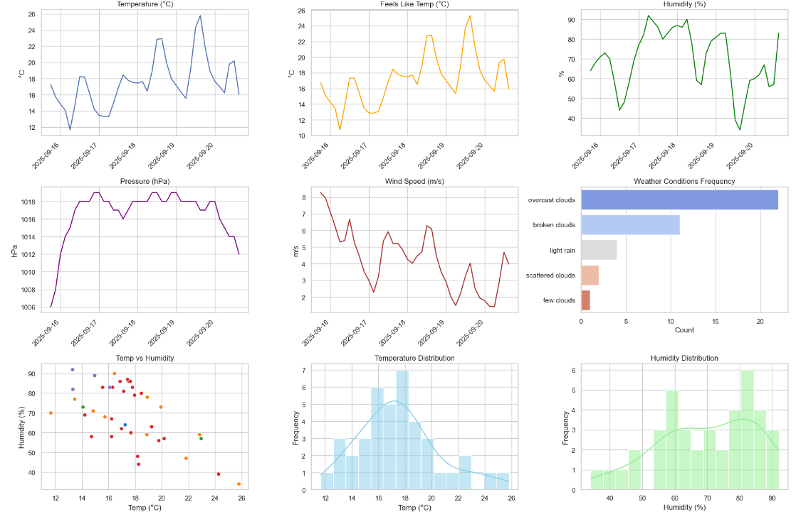
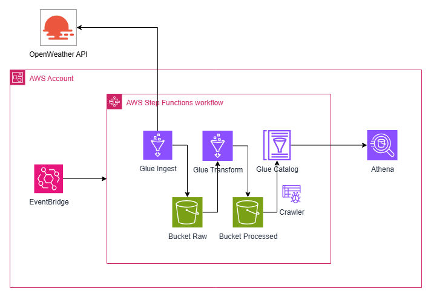

# 🌦️ OpenWeather Data Pipeline



## Overview

This project automates the ingestion, transformation, and cataloging of weather data retrieved from the **OpenWeather API**, using a serverless data pipeline on AWS. The processed data is made available for querying through **Amazon Athena**.

## Architecture



The solution is built using the following AWS components:

- **EventBridge** — Triggers the pipeline every **Monday at 12 PM (UTC)**.
- **Step Functions** — Orchestrates the workflow:
  1. **Glue Ingest Job**: Fetches weather data from the OpenWeather API and stores it in the Raw S3 bucket.
  2. **Glue Transform Job**: Cleans/transforms the data and stores it in the Processed S3 bucket.
  3. **Glue Crawler**: Scans the processed bucket and updates the Glue Catalog.
- **S3 Buckets**:
  - `weather-raw-*`: Stores raw weather data.
  - `weather-processed-*`: Stores transformed data.
  - `weather-glue-scripts-*`: Contains Glue ETL scripts.
  - `weather-states-*`: Backend and temporary storage.
- **AWS Glue Catalog** — Holds metadata for querying the processed data using Athena.
- **Amazon Athena** — Enables SQL queries over processed data stored in S3.

---

## Features

- 🛰️ Fully serverless, event-driven architecture  
- 📅 Scheduled execution using EventBridge  
- 🧪 Data cataloging with Glue Crawlers  
- 📊 Query-ready data in Athena  
- ⚙️ Infrastructure as Code with Terraform  
- ✅ GitHub Actions for CI/CD  

---

## Repository Structure

```bash
.
├── assets/
│   └── OpenWeatherArchitecture.png      # Architecture diagram
├── infra/
│   ├── s3.tf                            # S3 buckets and policies
│   ├── iam.tf                           # IAM roles and policies
│   ├── glue_ingest.tf                   # Glue job for ingestion
│   ├── glue_transform.tf                # Glue job for transformation
│   ├── glue_database.tf                 # Glue catalog database
│   ├── crawler.tf                       # Glue crawler for processed data
│   ├── step_functions.tf                # Step Function workflow
│   ├── eventbridge.tf                   # EventBridge rule
├── src/                                 # Glue scripts (ingest.py, transform.py)
├── main.tf                              # Terraform root module
├── .github/workflows/deploy.yml         # CI/CD pipeline for Terraform
└── README.md

## 🛠️ Deployment

This project uses **Terraform** to provision infrastructure and **GitHub Actions** for CI/CD.

### ⚙️ Terraform Workflow

When a pull request is opened to the `main` branch (or the workflow is manually triggered), the pipeline will:

1. Initialize Terraform
2. Import existing resources
3. Validate the configuration
4. Plan and apply the changes

### 🚀 Manual Trigger

You can also **manually trigger** the workflow from GitHub Actions with an option to destroy the resources using the `workflow_dispatch` input.

### ✅ Requirements

- AWS Account
- Terraform >= **1.5.7**
- GitHub Actions Secrets:
  - `AWS_ACCESS_KEY_ID`
  - `AWS_SECRET_ACCESS_KEY`
  - `API_KEY_API_WEATHER` (for OpenWeather API)

### 📌 Notes

- Imported resources like **S3 buckets** and **IAM roles** are already created **outside** Terraform. They are imported during deployment to avoid recreation.
- The use of the `terraform import` command inside the pipeline is **required** because Terraform does not manage pre-existing resources unless explicitly imported.
- Although the Terraform **backend** is defined in `main.tf`, the **initial state management** is bootstrapped via CI p